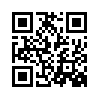

# 5 - Scan Surprise

## Descripcion

I've gotten bored of handing out flags as text. Wouldn't it be cool if they were an image instead?
You can download the challenge files here:

- [challenge.zip](https://artifacts.picoctf.net/c_atlas/15/challenge.zip)

The same files are accessible via SSH here:

```
ssh -p 49210 ctf-player@atlas.picoctf.net
```

Using the password

```
1db87a14
```

. Accept the fingerprint with

```
yes
```

, and

```
ls
```

once connected to begin. Remember, in a shell, passwords are hidden!

## Solucion

ingresamos y ponemos contrasena

`(xrengariox㉿PC)-[~/ex1/4]
└─$ ssh -p 49210 [ctf-player@atlas.picoctf.net](mailto:ctf-player@atlas.picoctf.net)
** WARNING: connection is not using a post-quantum key exchange algorithm.
** This session may be vulnerable to "store now, decrypt later" attacks.
** The server may need to be upgraded. See [https://openssh.com/pq.html](https://openssh.com/pq.html)[ctf-player@atlas.picoctf.net](mailto:ctf-player@atlas.picoctf.net)'s password:` nos muestra un qr que no se puede escanear por grande

buscamos la flag

`ctf-player@challenge:~/drop-in$ ls -la`

`total 4`

`drwxr-xr-x 2 ctf-player ctf-player  22 Mar 12  2024 .`

`drwxr-xr-x 1 ctf-player ctf-player  20 Mar 24 19:15 ..`

- `rw-r--r-- 1 root root 351 Mar 12 2024 flag.png`

`ctf-player@challenge:~/drop-in$ base64 flag.png
iVBORw0KGgoAAAANSUhEUgAAAGMAAABjAQMAAAC19SzWAAAABlBMVEUAAAD///+l2Z/dAAAAAnRS
TlP//8i138cAAAAJcEhZcwAACxIAAAsSAdLdfvwAAADxSURBVDiNzdSxbcQwDAXQf1Dh7rIAAa/h
TitZC1jRArmV1GkNA1pA6lwIYehLLr7GpnFFEFZ6AgSTEmnwc+AfqwAjco24aKrc/AKfZKEp0jTk
kOBOyMeez8qcErdpmN2W2a6kPpfIbdXuSqLYfNtucFdlkPo4PL5wIGYTIn9Y8pqKlXOEjpymyua2
0BvPuiKANnVr4pqkBfpi4TWVjkYrb9sHTTWaTyvnHrkciOmK/A4TNEnU1Mue1yRvK/0S1g1Fa1+n
HNjoiiT9AsgF6xrRrpgvJ+SXeRx+qj0SN8cE+zupu7rPtBT3PStH+us/0Wv6ApDopqsxeuqeAAAA
AElFTkSuQmCC`

vamos a la pagiuna y pegamos, nos arroja una imagen codigo qr escaneamos y la flag es la direccion

[https://codebeautify.org/base64-to-image-converter#google_vignette](https://codebeautify.org/base64-to-image-converter#google_vignette)



## Notas Adicionales

picoCTF{p33k_@_b00_19eccd10}

## Referencias